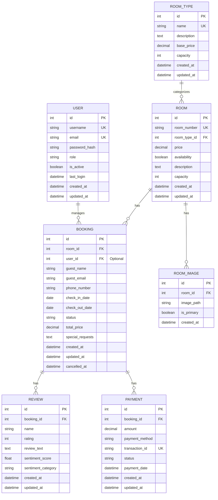

# Hotel Booking System - Entity Relationship Diagram

## Database Schema

## Relationships Explanation

1. **ROOM and ROOM_TYPE** (Many-to-One)
   - Each room belongs to one room type
   - Each room type can have multiple rooms
   - Attributes like base_price and capacity are inherited from room type

2. **ROOM and BOOKING** (One-to-Many)
   - One room can have many bookings (over time)
   - Each booking is associated with exactly one room
   - Room availability is tracked in real-time

3. **BOOKING and REVIEW** (One-to-Many)
   - Each booking can have multiple reviews
   - Each review is associated with exactly one booking
   - Reviews include sentiment analysis results

4. **USER and BOOKING** (One-to-Many)
   - Users (admin/staff) can manage multiple bookings
   - Each booking can be managed by one user
   - Guest bookings may not have associated users

5. **ROOM and ROOM_IMAGE** (One-to-Many)
   - Each room can have multiple images
   - One image is marked as primary for display
   - Images are stored with paths to filesystem

6. **BOOKING and PAYMENT** (One-to-Many)
   - Each booking can have multiple payment records
   - Each payment is associated with exactly one booking
   - Supports partial payments and payment history

## Key Features

1. **Data Integrity**
   - Primary Keys (PK) for unique identification
   - Foreign Keys (FK) for relationships
   - Unique Keys (UK) for business rules

2. **Audit Trail**
   - created_at timestamps for all entities
   - updated_at timestamps for trackable changes
   - cancelled_at for booking cancellations

3. **Business Rules**
   - Room availability status
   - Booking status tracking
   - Payment status monitoring
   - User role management

4. **Analytics Support**
   - Review sentiment analysis
   - Booking history
   - Payment tracking
   - Room occupancy rates

## Database Constraints

1. **Room Management**
   - Unique room numbers
   - Valid room type reference
   - Price must be positive

2. **Booking Rules**
   - Valid date ranges
   - No overlapping bookings
   - Required guest information

3. **Review System**
   - Rating range (1-5)
   - Valid booking reference
   - Sentiment score range (-1 to 1)

4. **Payment Processing**
   - Unique transaction IDs
   - Valid payment methods
   - Amount validation

## Notes

1. **Scalability Considerations**
   - Separate room_type table for flexibility
   - Image paths stored separately
   - Payment history preservation

2. **Security Features**
   - Password hashing
   - Role-based access
   - Activity logging

3. **Performance Optimization**
   - Indexed foreign keys
   - Optimized date ranges
   - Status tracking fields 