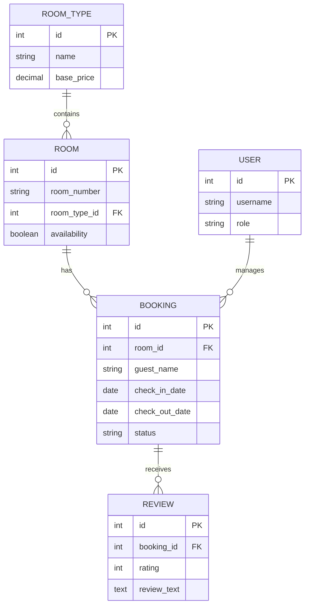

# Simplified ER Diagram - Core Relationships

## Core Relationships Overview

1. **Room Types and Rooms**
   - Each room type can have multiple rooms
   - Each room must belong to one room type

2. **Rooms and Bookings**
   - Each room can have multiple bookings
   - Each booking is for one specific room

3. **Bookings and Reviews**
   - Each booking can receive reviews
   - Each review belongs to one booking

4. **Users and Bookings**
   - Admin users manage bookings
   - Each booking can be managed by one user

## Key Business Rules

1. **Room Management**
   - Each room has a unique room number
   - Rooms must have a valid room type
   - Room availability is tracked

2. **Booking Process**
   - Valid check-in and check-out dates required
   - No double bookings allowed
   - Guest information is mandatory

3. **Review System**
   - Only confirmed bookings can be reviewed
   - Rating must be between 1 and 5
   - Reviews are linked to specific bookings

This simplified diagram shows the core entities and relationships in the hotel booking system, making it easier to understand the basic structure without the additional complexity of audit fields, optional relationships, and supporting entities. 