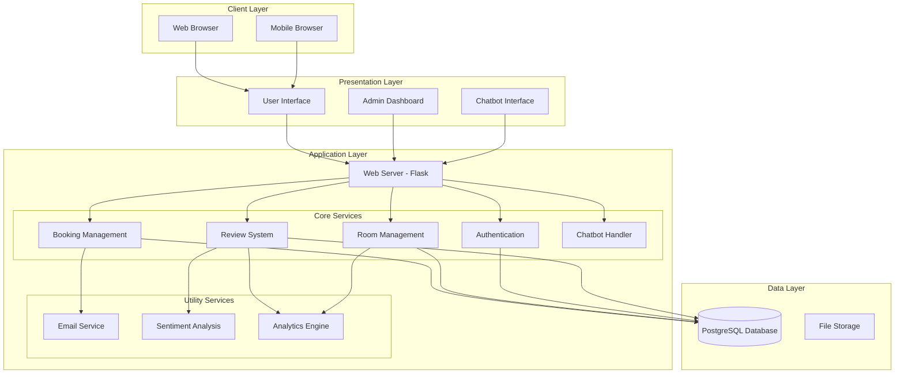
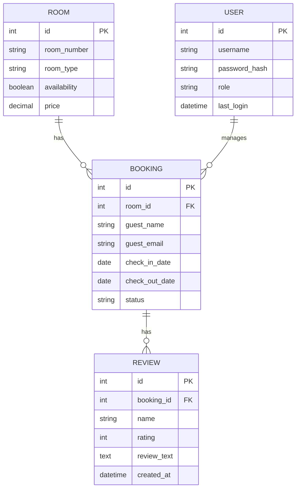
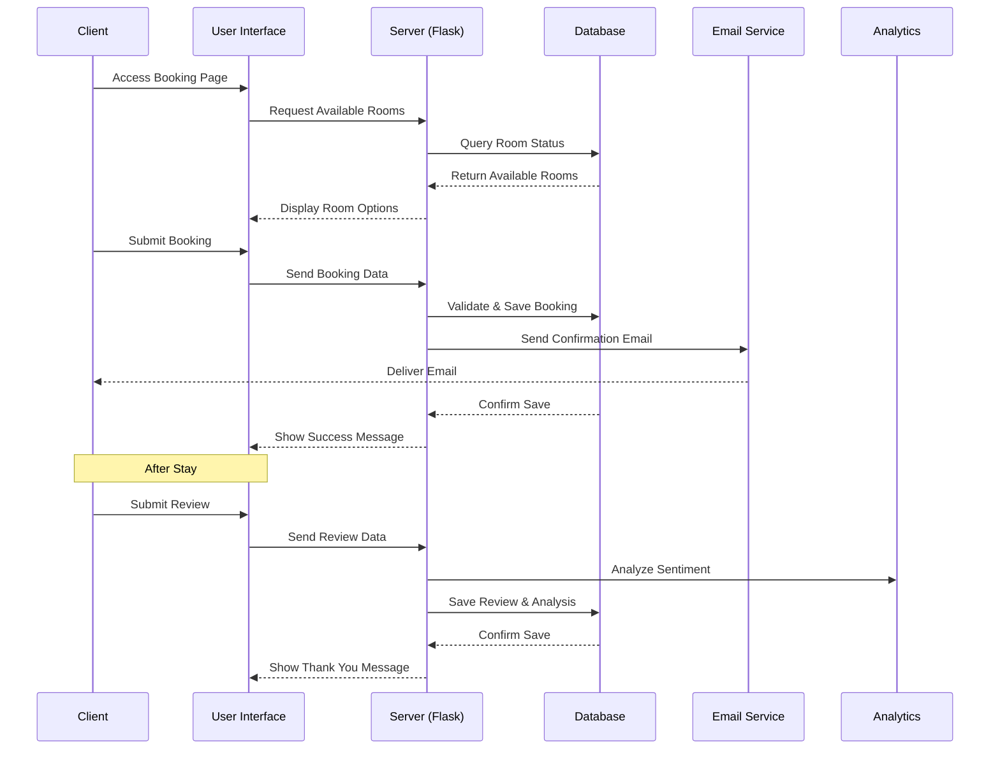
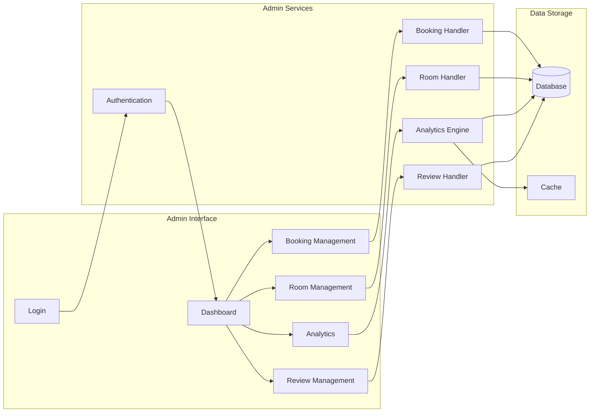
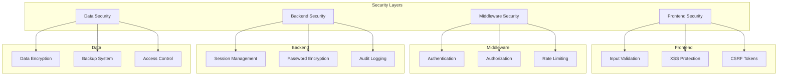
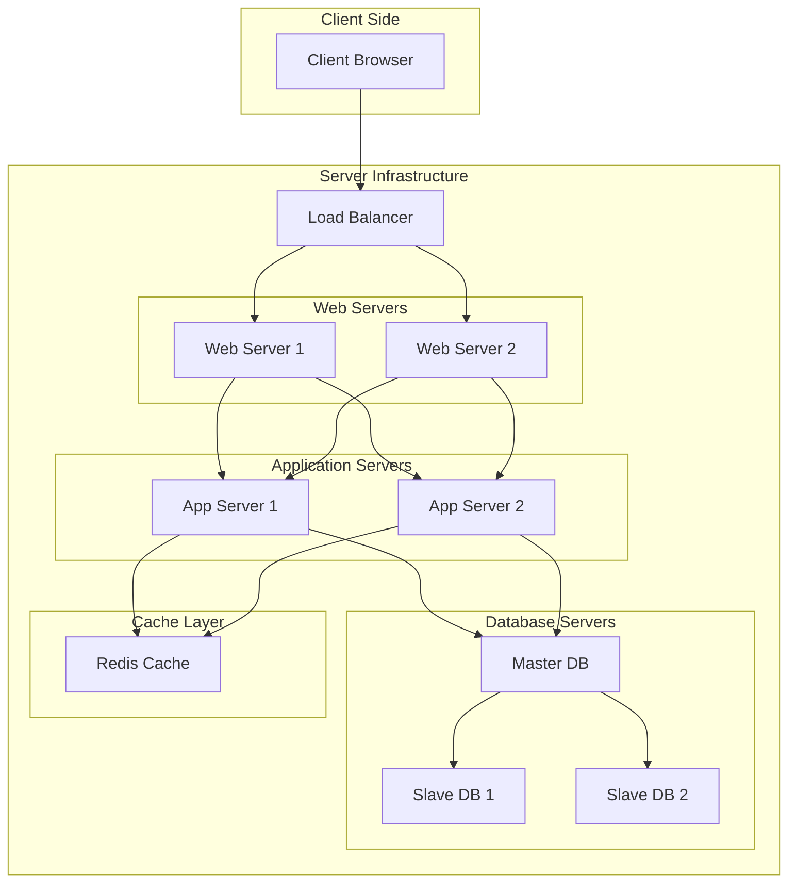

# Hotel Booking System - System Diagrams

## 1. High-Level System Architecture

## 2. Database Schema

## 3. Component Interaction Flow

## 4. Admin Dashboard Architecture

## 5. Security Implementation

## 6. Deployment Architecture

These diagrams provide a comprehensive visualization of the hotel booking system's architecture, including:

1. High-Level System Architecture: Shows the overall system structure and component interactions
2. Database Schema: Illustrates the database design and relationships
3. Component Interaction Flow: Demonstrates the booking and review process flow
4. Admin Dashboard Architecture: Details the admin interface and its components
5. Security Implementation: Shows the security measures at different layers
6. Deployment Architecture: Illustrates the production deployment setup

Each diagram is created using Mermaid.js syntax and can be rendered in any Markdown viewer that supports Mermaid diagrams. The diagrams help visualize:

- System components and their relationships
- Data flow between components
- User interaction patterns
- Security implementation
- Deployment structure

These diagrams can be used in your thesis to explain the system's architecture and functionality. 